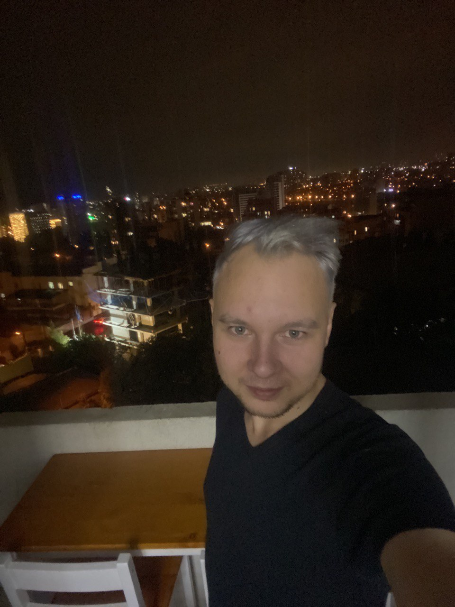

# My first page "About me"

## Основная информаци

Меня зовут Зырин Александр, мне 27 лет. Родился и вырос в городе Омск, тамже окончил технический государственный университет. Имеется степень баклавра по направлею технологические машины и оборудование - химические аппараты, а также степень магистра по направлению холодильная, криогенная техника и системы жизнеобеспечения.

### Опыт работы:

Работал в Израильской компании [Модкон](https://www.modcon-systems.com) на должности инженера по поналадке и сервису поточных анализаторов. 

Работал с разными видами поточных анализаторов, такими как:
* NIR анализаторы;
* Газовые хроматографы;
* Анализаторы серы;
* Анализаторы фракционного состава;
* Анализаторы плотности (плотномеры);
* pH-метры.

Из оборудования занимался пусконаладкой и сервисом следующего оборудования:

* [Process Gas Chromatograph GC8000](https://www.yokogawa.com/solutions/products-and-services/measurement/analyzers/gas-analyzers/process-gas-chromatographs/process-gas-chromatograph-gc8000/#Details)
* [MCS100E HW](https://www.sick.com/us/en/analyzer-solutions/cems-solutions/mcs100e-hw/c/g285463)
* [Beacon - 3000 II](https://www.modcon-systems.com/project/process-nir-analyzer/)
* [Distillation Process Analyzer DPA-4](https://www.bartec.de/en/products/analyzers-and-measurement-technology/analyzers-and-analyzer-systems/analyzers-bartec-benke/distillation-process-analyzer-dpa-4/)
* [Vapor Pressure Process Analyzer RVP-4](https://www.bartec.de/en/products/analyzers-and-measurement-technology/analyzers-and-analyzer-systems/analyzers-bartec-benke/vapor-pressure-process-analyzer-rvp-4/)
* [Sindie Online](https://www.xos.com/sulfur-online/sindie-online/family?productCategoryId=53596617566)

Помимо работы с самим оборудованием, занимался обследованиями производства (выбор мест врезок отбора и возврата, место установки шелтеров и анализаторв, прокладка кабельных и трубных трасс). 

Заказчики:
* [Роснефть](https://www.rosneft.ru)
* [Газпромнефть](https://www.gazprom-neft.ru)

## Контакты:
[Инстаграм](https://www.instagram.com/alexandrzyrin)

[Вконтакте](https://vk.com/mordecay2212)
